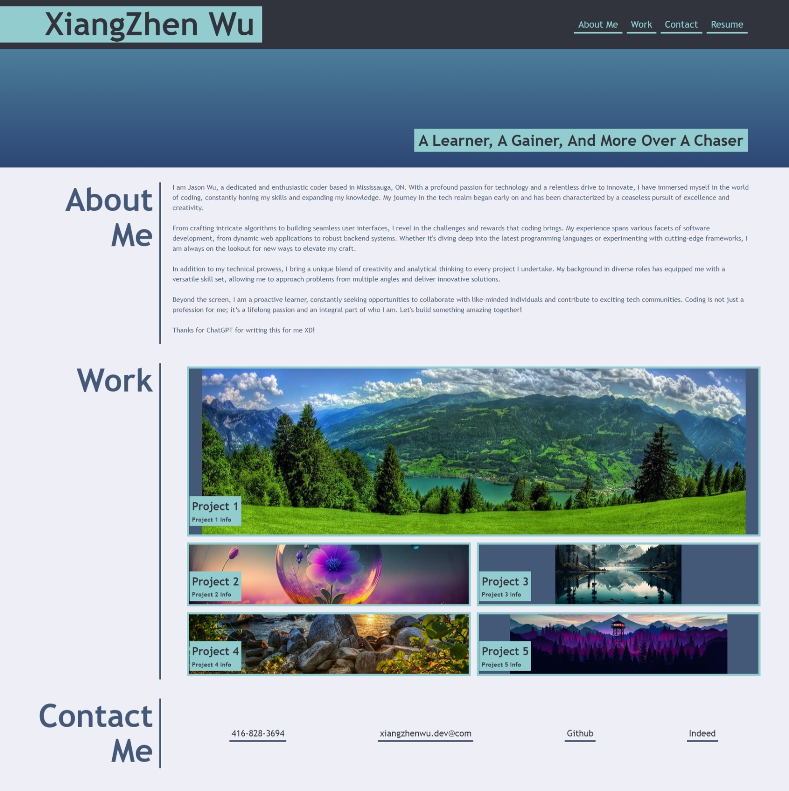
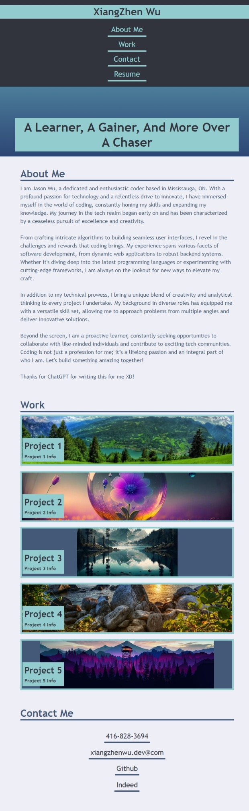

<My-Portfolio>

## Description

- The motivation is just simply for letting employer know what I am capable for.
- Creating a page that tells people who I am and what I had work on. Then organize them into more    readable and accessable pieces.
- In this coding journey, I encounter the usage of flexbox for positioning, and image sizing issue.
- Learnt about flexbox feature, such as justify-content, align-content, and so on. For the image, I tried the usage of position: relative & abosulte, object: fit, and overflow. It was a lot of pain but FUN!

## Installation

Download the project from my github(https://github.com/AdminChatter), and then open the index.html. Have Fun!

## Usage

When you click the navgation bar on the top right, it will bring you to each section.
- Desktop Preview 

- Moblie Preview

